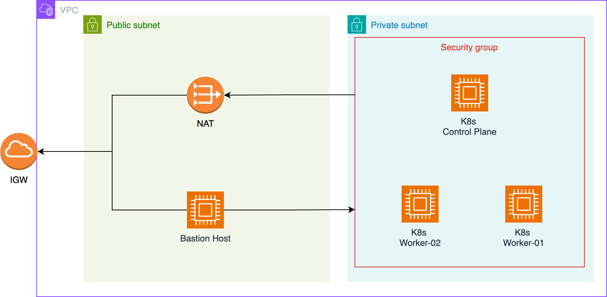

# K8s cluster on AWS

### Cloud Infrastructure

In the ```infrastructure``` folder are all resources specified to get the following setup running in AWS.
It includes a ```VPC```, ```Public subnet```, ```Private subnet```, ```Internet Gateway (IGW)```, ```NAT```, ```Bastion Host``` in the Public subnet and 
three machines in the Private subnet.
The setup follow best practices, the nodes of the k8s cluster will be created in the private subnet only.
The nodes can connect to the internet via a NAT which is placed in the Public subnet and connected to the IGW.
The Bastion Host allows to connect to the k8s nodes in a secure way via ssh, without exposing the k8s to the internet.
This is important, as the k8s nodes need to open several ports to make k8s running.

*Note:* Not all resources (e.g. Route Tables, Key Pair, etc.) are not showed in this architecture

<p align="center">

</p>

## Set up the k8s cluster

### Generate ssh key pair

```angular2html
ssh-keygen -t rsa -b 2048 -f ssh_key
```

### 

### Manually connect to EC2 instances

#### Connect to bastion host

```angular2html
ssh -i ssh_key ec2-user@<BASTION_HOST_PUBLIC_IP>
```

#### Connect to private host via bastion host

Use the bastion host as a proxy to jump forward to the private hosts within the private subnet

```angular2html
ssh -i ssh_key -o ProxyCommand="ssh -i ssh_key -W %h:%p ec2-user@<BASTION_HOST_PUBLIC_IP>" ec2-user@<PRIVATE_HOST_PRIVATE_IP>
```


#### Links

- [Terraform Icons](https://github.com/kubernetes/community/tree/master/icons)
- [AWS Architecture Icons](https://aws.amazon.com/architecture/icons/)