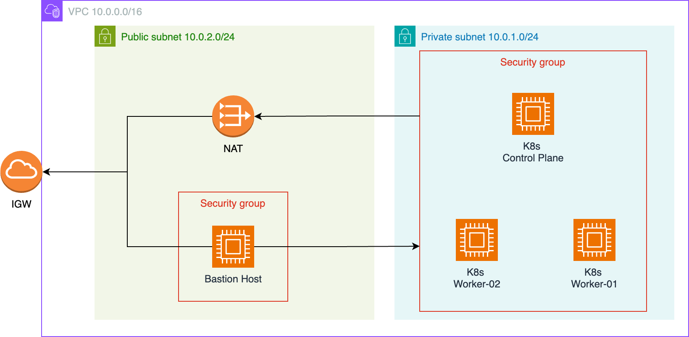
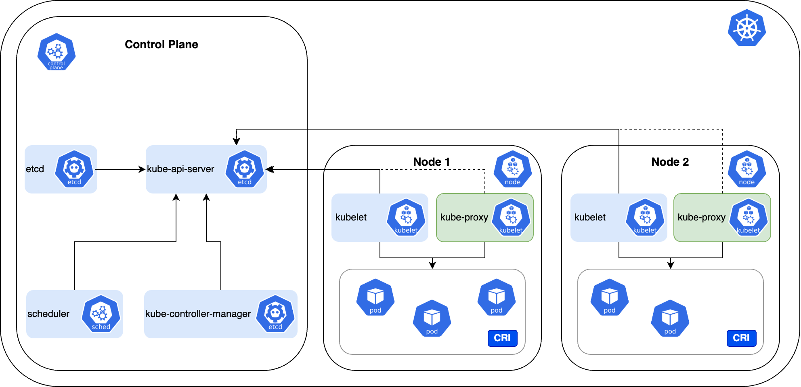
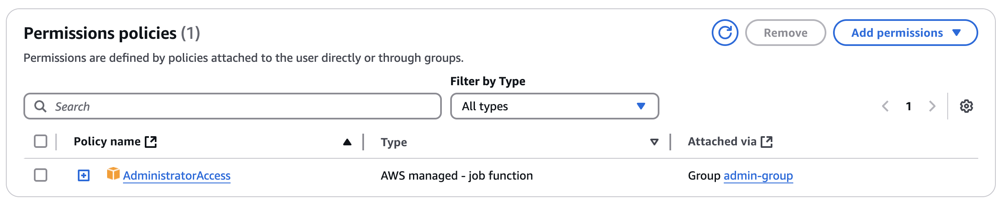

# K8s cluster on AWS

## Infrastructure

The infrastructure is based on AWS and all resources are describes in Terraform.
The default setup creates a ```VPC``` for all the resources as ```Public subnet```, ```Private subnet```, ```Internet Gateway (IGW)```, ```NAT```, ```EC2 Machines```, etc.
The ```EC2 Machines``` for the k8s cluster will be deployed to the ```Private Subnet``` to keep them protected.
They can be accessed via ```ssh``` from the ```Bastion Host```.

*Note:* Not all resources (e.g. Route Tables, Key Pair, etc.) are not showed in this architecture

<p align="center">

</p>

## K8s cluster overview

<p align="center">

</p>

The project is using [kubeadm](https://kubernetes.io/docs/setup/production-environment/tools/kubeadm/create-cluster-kubeadm/)
to set up the k8s cluster. 

**Control Plane**

- **kube-api-server** provides API to access the k8s cluster
- **etcd** is a key-value store for cluster configuration and state
- **scheduler** is responsible to place pods efficiently on nodes
- **kube-controller-manager** hold core control loop to bring cluster state into desired state (nodes, pods, replicas, etc.)

**Node**

- **kubelet** is the primary node agent that runs on every node
- **kube-proxy** runs on each node and manages network communication. 
- **CRI** stands for ***Container Runtime Interface*** and is a specification to run containers. This setup uses [containerd](https://containerd.io/) as container runtime which implements the CRI
- **[flannel](https://github.com/flannel-io/flannel)** is the default CNI plugin

## Install k8s cluster

### 1. Generate ssh key pair

Create a new ssh keypair in ```./keys```  named ```ssh```.  Note that 
the Ansible setup expects the key with that name and location.

```angular2html
ssh-keygen -t rsa -b 2048 -f ./keys/ssh_key
```

### 2. Create infrastructure

Create an AWS user for the Terraform setup. Go to ```IAM > Users > Create User``` and crate a new user with
```AdministratorAccess``` permissions. 


<p align="center">

</p>

Then, go to ```./infrastructure/main.tf``` and replace ```access_key``` and ```secret_key``` from your new account.

```terraform
provider "aws" {
  region     = var.region
  access_key = "XXX"
  secret_key = "XXX"
}
```

Once this is done, you can create the infrastructure:

```terraform
terrafrom apply
```

After the resources have been successfully created the inventory file can be found in ```./generated/inventory.ini```.  

**Note: You can further configure the infrastructure setup in ```variables.tf``` (e.g. change the region)**

### 3. Install k8s cluster with Ansible

**Control Plane**

```
ansible-playbook -i ../generated/inventory.ini control-plane.yml
```

**Note: The setup for the control plane will output ```./ansible/kubernetes_join_command``` for the worker nodes to join**

**Worker**

```
ansible-playbook -i ../generated/inventory.ini worker.yml
```


## Manually connect to EC2 instances


***Bastion host***
```angular2html
ssh -i ssh_key ubuntu@<BASTION_HOST_PUBLIC_IP>
```

***Private host via Bastion host***
```angular2html
ssh -i ssh_key -o ProxyCommand="ssh -i ssh_key -W %h:%p ubuntu@<BASTION_HOST_PUBLIC_IP>" ubuntu@<PRIVATE_HOST_PRIVATE_IP>
```

***Note: you can find the IP address of the hosts either in ```./generated/invetory.ini``` or simply look it up in the AWS console***

## Features

- [x] Enable k8s cluster setup on AWS
- [ ] Expose services (e.g. use API Gateway) 
- [ ] Enable Cluster Autoscaler 
- [ ] Enable multi AZ deployment of the k8s cluster

## Links

- [Terraform Icons](https://github.com/kubernetes/community/tree/master/icons)
- [AWS Architecture Icons](https://aws.amazon.com/architecture/icons/)